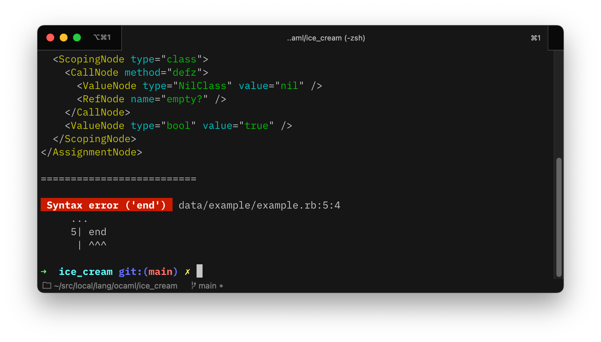

## Ice Cream - A Ruby Type Inference Engine

### Todo List

- [x] Ruby parser
- [ ] Parse RBS files to build library of type interfaces
- [ ] Compute algebraic subtyping annotations (+/- flows)
- [ ] Apply constraints to type annotations

### Current Status

#### Parsing _(kinda-sorta)_ works!

```sh
$ make build
dune build bin/cli.exe

$ make run
OCAMLRUNPARAM=b dune exec bin/cli.exe -- --dir=data/example
Importing file:  `data/example/example.rb`
Importing file:  `data/example/rbs/example.rbs`
...
```

#### There's even some poor error messaging! 



#### …and support for RBS!

```sh
$ make build
dune build bin/cli.exe

$ make check
OCAMLRUNPARAM=b dune exec bin/cli.exe -- --dir=data/example --check
Importing file:  `data/example/rbs/example.rbs`
class Example #empty? (bool) -> bool
```

#### (Un)Supported Syntax

See [Kitchen Sink demo](data/kitchen_sink/kitchen_sink.rb) for supported syntax, but this is a non-exhaustive rough list of what doesn't work yet:

```ruby
# string interpolation
"Hello, #{name}"

# curly-braced do-blocks 
foo { |x| x.bar }

# object method calls without parens
x.foo true

# heredoc
<<~MSG
Hello, name!
MSG

# heredoc method call
<<~MSG.trim
Hello
world!
MSG

# ambiguous do-block
foo bar do |x| # block belongs to foo, not bar!
  x.baz
end

# trailing commas
{ 
  foo: :bar,
}

# operators
x | 0
a + b

# ...and a lot more!
```

### Examples

#### AST Generation

<details>
<summary>Input</summary>

```ruby
module ChatApp
  VERSION = "1.0.0"

  class User
    attr_reader :login
    attr_reader :email

    def initialize(login, email); end
  end

  class Bot
    attr_reader :name
    attr_reader :email
    attr_reader :owner

    def initialize(name, owner); end
  end

  class Message
    attr_reader :id
    attr_reader :string
    attr_reader :from
    attr_reader :reply_to

    def initialize(from, string)
      @from = from
      @string = string
    end

    def reply(from, string)
      m = Message.new
      m
    end
  end

  class Channel
    attr_reader :name
    attr_reader :messages
    attr_reader :users
    attr_reader :bots

    def initialize(name); end
    def each_member; end
  end
end
```
</details>

<details>
<summary>Output</summary>

```clj
(casgn 
    (const 
        (nesting []) `ChatApp) 
    (module 
        (casgn 
            (const 
                (nesting []) `VERSION) "1.0.0") 
        (casgn 
            (const 
                (nesting []) `User) 
            (class 
                (send nil `attr_reader 
                    (args :login)) 
                (send nil `attr_reader 
                    (args :email)) 
                (def `initialize 
                    (params 
                        (param `login) 
                        (param `email)) nil) 
                ())) 
        (casgn 
            (const 
                (nesting []) `Bot) 
            (class 
                (send nil `attr_reader 
                    (args :name)) 
                (send nil `attr_reader 
                    (args :email)) 
                (send nil `attr_reader 
                    (args :owner)) 
                (def `initialize 
                    (params 
                        (param `name) 
                        (param `owner)) nil) 
                ())) 
        (casgn 
            (const 
                (nesting []) `Message) 
            (class 
                (send nil `attr_reader 
                    (args :id)) 
                (send nil `attr_reader 
                    (args :string)) 
                (send nil `attr_reader 
                    (args :from)) 
                (send nil `attr_reader 
                    (args :reply_to)) 
                (def `initialize 
                    (params 
                        (param `from) 
                        (param `string)) 
                    (ivasgn @from 
                        (lvar `from)) 
                    (ivasgn @string 
                        (lvar `string)) 
                    ()) 
                (def `reply 
                    (params 
                        (param `from) 
                        (param `string)) 
                    (lvasgn `m 
                        (send 
                            (const 
                                (nesting []) `Message) `new 
                            (args ))) 
                    (lvar `m) 
                    ()) 
                ())) 
        (casgn 
            (const 
                (nesting []) `Channel) 
            (class 
                (send nil `attr_reader 
                    (args :name)) 
                (send nil `attr_reader 
                    (args :messages)) 
                (send nil `attr_reader 
                    (args :users)) 
                (send nil `attr_reader 
                    (args :bots)) 
                (def `initialize 
                    (params 
                        (param `name)) nil) 
                (def `each_member 
                    () nil) 
                ())) 
        ()))
```
</details>

#### Queries

```ocaml
(* my_ast_query.ml *)

let index = Ast_index.create ast in
  index
  |> Query.query_all ~f:(fun node ->
    (Node.node_type node) = "MethodNode"
  )
  |> List.iter (fun node ->
    print_endline @@ "# Original code:";
    print_endline @@ Location.loc_as_string (Node.location node);

    print_endline @@ "# RBS:";
    print_endline @@ Node.to_rbs node;

    print_endline @@ "\n# AST node:";
    print_endline @@ Node.pretty_print node;
    
    print_endline "\n==========================\n";
  );
```

<details>
<summary>Output</summary>

```xml
==========================
# Original code:
     ...
    23| def sum0; false end
      | ^^^^^^^^

# RBS:
def sum0: () -> untyped

# AST node:
<MethodNode name="sum0">
  <ValueNode type="bool" value="false" />
</MethodNode>

==========================

# Original code:
     ...
    25| def sum1(); true end
      | ^^^^^^^^^^

# RBS:
def sum1: () -> untyped

# AST node:
<MethodNode name="sum1">
  <ValueNode type="bool" value="true" />
</MethodNode>

==========================

# Original code:
     ...
    27| def sum2(thing)
      | ^^^^^^^^^^^^^^^

# RBS:
def sum2: (untyped thing) -> untyped

# AST node:
<MethodNode name="sum2">
  <ValueNode type="Integer" value="45" />
</MethodNode>

==========================

# Original code:
     ...
    31| def sum3(thing1, thing2) end
      | ^^^^^^^^^^^^^^^^^^^^^^^^

# RBS:
def sum3: (untyped thing1, untyped thing2) -> untyped

# AST node:
<MethodNode name="sum3">
  <ValueNode type="NilClass" value="nil" />
</MethodNode>

==========================

# Original code:
     ...
    33| def maybe_sum(a, b, should_do_thing) end
      | ^^^^^^^^^^^^^^^^^^^^^^^^^^^^^^^^^^^^

# RBS:
def maybe_sum: (untyped a, untyped b, untyped should_do_thing) -> untyped

# AST node:
<MethodNode name="maybe_sum">
  <ValueNode type="NilClass" value="nil" />
</MethodNode>

==========================

# Original code:
     ...
    35| def named_args(foo: true, bar: 3) end
      | ^^^^^^^^^^^^^^^^^^^^^^^^^^^^^^^^^

# RBS:
def named_args: (?foo: bool, ?bar: Integer) -> untyped

# AST node:
<MethodNode name="named_args">
  <ValueNode type="NilClass" value="nil" />
</MethodNode>

==========================

# Original code:
     ...
    36| def default_args(x, foo = true, bar = false) end
      | ^^^^^^^^^^^^^^^^^^^^^^^^^^^^^^^^^^^^^^^^^^^^

# RBS:
def default_args: (untyped x, ?bool foo, ?bool bar) -> untyped

# AST node:
<MethodNode name="default_args">
  <ValueNode type="NilClass" value="nil" />
</MethodNode>

==========================

# Original code:
     ...
    37| def mixed_args(foo, bar = 3, baz: nil) end
      | ^^^^^^^^^^^^^^^^^^^^^^^^^^^^^^^^^^^^^^

# RBS:
def mixed_args: (untyped foo, ?Integer bar, baz?: Any?) -> untyped

# AST node:
<MethodNode name="mixed_args">
  <ValueNode type="NilClass" value="nil" />
</MethodNode>

==========================
```
</details>